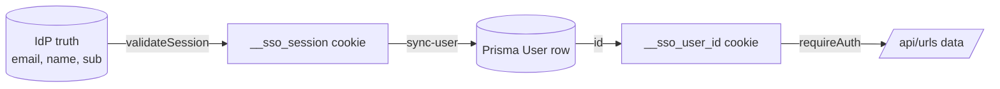
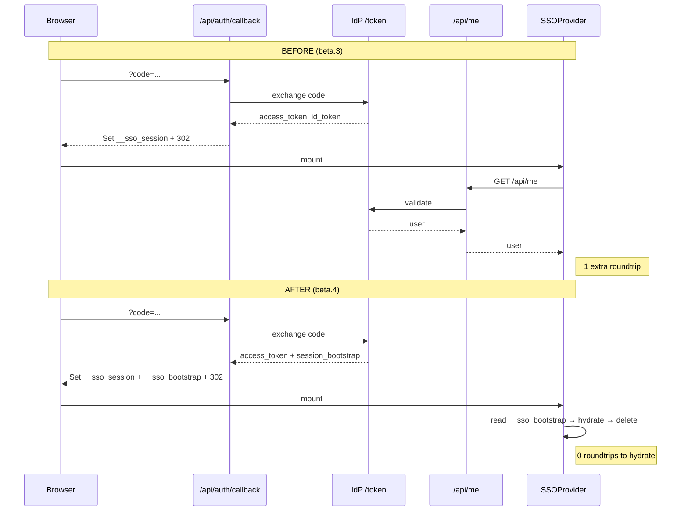

# MySSO Integration Mindmap

> How `pratham-sso` package, app routes, and the IdP server work together in this project.
> Use this as reference when onboarding new mysso users.
>
> **Package version:** `pratham-sso@0.0.1-beta.4` — adds session bootstrap cookie to skip the first `/api/me` on hydration.

---

## 1. What `pratham-sso` Provides (Currently Used)

| Export | Type | Used In | Purpose |
|---|---|---|---|
| `SSOProvider` | React component | [app/providers.tsx](app/providers.tsx) | Wraps app, supplies session context |
| `useSSO()` | React hook | [app/page.tsx](app/page.tsx), [app/dashboard/page.tsx](app/dashboard/page.tsx), [components/LoginButton.tsx](components/LoginButton.tsx), [app/providers.tsx](app/providers.tsx) | Returns `{ session, loading, signIn(), logout() }` |
| `startAuth` | Server handler | [app/api/auth/start/route.ts](app/api/auth/start/route.ts) | Builds OAuth authorize URL + redirects to IdP |
| `handleCallback` | Server handler | [app/api/auth/callback/route.ts](app/api/auth/callback/route.ts) | Exchanges `code` → tokens, sets `__sso_session` cookie |
| `handleLogout` | Server handler | [app/api/auth/logout/route.ts](app/api/auth/logout/route.ts) | Clears session, redirects to IdP logout |
| `validateSession` | Server handler | [app/api/me/route.ts](app/api/me/route.ts) | Validates `__sso_session`, returns IdP user info |

**Config required (env):** `NEXT_PUBLIC_IDP_SERVER`, `NEXT_PUBLIC_CLIENT_ID`, `NEXT_PUBLIC_REDIRECT_URI`, `OAUTH_SECRET`.

---

## 2. Full Flow — Login → Sync → Protected Data

```mermaid
flowchart TD
    U([User Browser])
    LB[LoginButton<br/>components/LoginButton.tsx]
    SSO[SSOProvider + useSSO<br/>app/providers.tsx]

    subgraph APP_ROUTES [Next.js API Routes]
      START["/api/auth/start<br/>startAuth()"]
      CB["/api/auth/callback<br/>handleCallback()"]
      ME["/api/me<br/>validateSession()"]
      SYNC["/api/auth/sync-user<br/>custom handler"]
      LOGOUT["/api/auth/logout<br/>handleLogout()"]
      URLS["/api/urls, /api/urls/[id]<br/>requireAuth()"]
    end

    IDP[(IdP Server<br/>NEXT_PUBLIC_IDP_SERVER)]
    DB[(MongoDB via Prisma<br/>User table)]
    RA[requireAuth<br/>lib/serverAuth.ts]

    U -->|click Sign In| LB
    LB -->|signIn| SSO
    SSO -->|GET| START
    START -->|302 authorize?client_id,redirect_uri,state| IDP
    IDP -->|user logs in| IDP
    IDP -->|302 ?code=AUTH_CODE&state=STATE| CB
    CB -->|POST /token code+secret| IDP
    IDP -->|access_token + id_token + session_bootstrap| CB
    CB -->|Set-Cookie __sso_session (HttpOnly)| U
    CB -->|Set-Cookie __sso_bootstrap 60s JSON readable| U
    CB -->|302 redirect| U

    U -->|loads dashboard| SSO
    SSO -->|read __sso_bootstrap cookie| SSO
    SSO -->|hydrate session, delete cookie, SKIP first /api/me| SSO
    SSO -->|POST auto-trigger| SYNC
    SYNC -->|POST forwards __sso_session| ME
    ME -->|validateSession __sso_session| IDP
    IDP -->|user email, name, sub| ME
    ME -->|JSON user| SYNC
    SYNC -->|find/create by email| DB
    DB -->|dbUser id| SYNC
    SYNC -->|Set-Cookie __sso_user_id 30d| U
    SYNC -->|success + user| SSO

    U -->|GET /api/urls + both cookies| URLS
    URLS --> RA
    RA -->|__sso_session check| RA
    RA -->|lookup by __sso_user_id| DB
    DB -->|User record| RA
    RA -->|authorized user| URLS
    URLS -->|user's URLs JSON| U

    U -->|Sign Out| LOGOUT
    LOGOUT -->|clear cookies| U
    LOGOUT -->|302 to IdP logout| IDP
```

---

## 3. Node Catalog (Vertices)

### Client-side
- **LoginButton** — [components/LoginButton.tsx](components/LoginButton.tsx). Calls `signIn()` from `useSSO()`.
- **SSOProvider** — [app/providers.tsx:59](app/providers.tsx#L59). Wraps app; reads `__sso_session`; exposes session.
- **SyncUserOnAuth** — [app/providers.tsx:14-55](app/providers.tsx#L14-L55). Watches `session.user.email`; fires `/api/auth/sync-user` once per account.
- **Dashboard** — [app/dashboard/page.tsx](app/dashboard/page.tsx). Gated on `session?.user?.email` + `isSynced`.

### Server routes
- **`/api/auth/start`** — [app/api/auth/start/route.ts](app/api/auth/start/route.ts). Delegates to `startAuth()`.
- **`/api/auth/callback`** — [app/api/auth/callback/route.ts](app/api/auth/callback/route.ts). Delegates to `handleCallback()` → sets `__sso_session` **and** `__sso_bootstrap` (60s JS-readable cookie with `{ user, account, accounts, activeAccountId }`).
- **`/api/me`** — [app/api/me/route.ts](app/api/me/route.ts). Delegates to `validateSession()`.
- **`/api/auth/sync-user`** — [app/api/auth/sync-user/route.ts](app/api/auth/sync-user/route.ts). Validates via `/api/me`, upserts DB user, sets `__sso_user_id`.
- **`/api/auth/logout`** — [app/api/auth/logout/route.ts](app/api/auth/logout/route.ts). Delegates to `handleLogout()`.
- **`/api/urls`** & **`/api/urls/[id]`** — [app/api/urls/route.ts](app/api/urls/route.ts), [app/api/urls/[id]/route.ts](app/api/urls/[id]/route.ts). Protected by `requireAuth()`.

### Helpers
- **`requireAuth()` / `getCurrentUser()` / `hasValidSession()`** — [lib/serverAuth.ts](lib/serverAuth.ts). Cookie → DB user lookup.
- **Prisma client** — [lib/prisma.ts](lib/prisma.ts). MongoDB access.

### External
- **IdP Server** — OAuth2 authorize + token endpoints.
- **MongoDB** — `User` and `Url` collections ([prisma/schema.prisma](prisma/schema.prisma)).

---

## 4. Edge Catalog (Data Traveling)

| # | From → To | Data on the edge |
|---|---|---|
| 1 | LoginButton → `useSSO.signIn()` → `/api/auth/start` | `GET` request |
| 2 | `/api/auth/start` → IdP | `302` with `client_id`, `redirect_uri`, `response_type=code`, `state` |
| 3 | IdP → `/api/auth/callback` | `302` with `code`, `state` |
| 4 | `/api/auth/callback` ↔ IdP `/token` | send `code` + `OAUTH_SECRET`; receive `access_token`, `id_token`, `expires_in`, **`session_bootstrap` `{ user, account, accounts, activeAccountId }`** |
| 5 | `/api/auth/callback` → browser | `Set-Cookie: __sso_session` (HttpOnly, Secure, Lax) + `Set-Cookie: __sso_bootstrap` (JS-readable, 60s, carries `session_bootstrap` JSON) |
| 5a | Browser → `SSOProvider` (mount) | Reads `__sso_bootstrap` → hydrates `session` in memory → deletes the cookie → **skips the first `/api/me`** call. Falls back to normal `/api/me` flow if cookie is absent. |
| 6 | Browser → `SyncUserOnAuth` → `/api/auth/sync-user` | `POST` + `__sso_session` cookie |
| 7 | `/api/auth/sync-user` → `/api/me` → IdP | `__sso_session` → decoded user `{ email, name, sub }` |
| 8 | `/api/auth/sync-user` ↔ Prisma | `findUnique({email})` → create if missing → update name if missing |
| 9 | `/api/auth/sync-user` → browser | `Set-Cookie: __sso_user_id` (30d) + JSON `{success, user:{id,email,name}}` |
| 10 | Browser → `/api/urls*` | request + both cookies |
| 11 | `/api/urls*` → `requireAuth()` → Prisma | validates `__sso_session`, loads user by `__sso_user_id` |
| 12 | `/api/urls*` → browser | user-scoped URL data |
| 13 | Browser → `/api/auth/logout` → IdP | clears cookies; redirect to IdP logout |

---

## 5. Cookies at a Glance

| Cookie | Set by | Read by | Lifetime | Flags |
|---|---|---|---|---|
| `__sso_session` | `handleCallback()` ([callback route](app/api/auth/callback/route.ts)) | `validateSession()`, `requireAuth()` | Session | HttpOnly, Secure, Lax |
| `__sso_bootstrap` | `handleCallback()` (beta.4) | `SSOProvider` on mount (client-side, one-shot) | 60s — deleted after read | JS-readable; carries `SessionBootstrap` JSON to skip first `/api/me` |
| `__sso_user_id` | `/api/auth/sync-user` | `requireAuth()`, `getCurrentUser()` | 30 days | HttpOnly |

---

## 6. Two-Layer Identity Model



**Why two cookies?** `__sso_session` proves *who you are* (IdP). `__sso_user_id` is a fast local pointer to your DB row so protected routes don't re-hit `/api/me` on every request.

**Third cookie (ephemeral, beta.4):** `__sso_bootstrap` — written alongside `__sso_session` at callback, read once by `SSOProvider` on mount, then deleted. Inlines the payload the first `/api/me` would have returned so hydration is a zero-roundtrip path. If missing (e.g. expired, navigated days later), `SSOProvider` falls back to calling `/api/me` as before. SSR-safe: only read in `useEffect`.

---

## 7. Hydration Roundtrip — Before vs After (beta.4)


